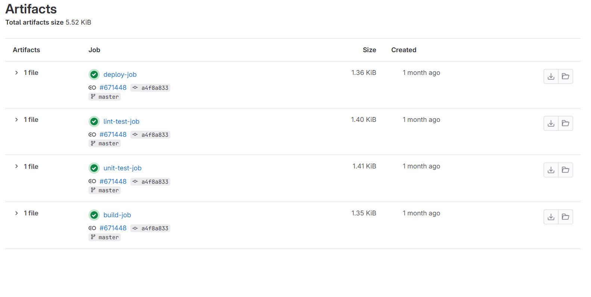
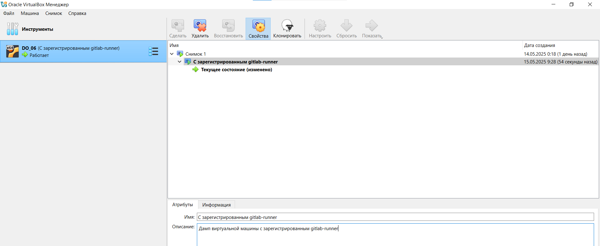

## Part 1. Настройка gitlab-runner

Подними виртуальную машину Ubuntu Server 22.04 LTS.

Настройка вашего gitlab-runner

- В репозитории пиров есть зарегистрированный gitlab-runner, что подтверждается запущенными и завершенными конвейерами в репозитории

- Добавил официальный репозиторий GitLab командой:
 > curl -L "https://packages.gitlab.com/install/repositories/runner/gitlab-runner/script.deb.sh" | sudo bash

- Установка_гитлаб_раннера

> .png)

*Запустил_gitlab-runner_и_зарегистрировал_его_для_использования_в_текущем_проекте_(DO6_CICD)*

- В репозитории пиров есть дамп виртуальной машины с зарегистрированным gitlab-runner

> 

> 

*Дамп виртуальной машины с зарегистрированным gitlab-runner*

✅ GitLab Runner зарегистрирован

✅ .gitlab-ci.yml файл добавлен и корректно настроен — структура пайплайна понятна, разбита на build, test и deploy стадии.

✅ Пайплайн успешно запущен и прошёл все стадии — все 4 джоба (build, unit test, lint, deploy) завершились со статусом Passed.

✅ Всё выполняется в репозитории  —  в Students_repo / spectrew / DO6_CICD.ID_356283-1, как и требуется по условию.

✅ Дамп виртуальной машины с зарегистрированным gitlab-runner

## Part 2. Сборка

* Коммит из последнего пайплайна совпадает с последним коммитом в репозитории.
* Джоб сборки (build) в последнем пайплайне успешно завершён (отмечен галочкой).
* В этой джобе есть артефакты, которые можно просмотреть и скачать.
* Артефакты содержат утилиты `s21_grep` и `s21_cat` из проекта SimpleBashUtils.
